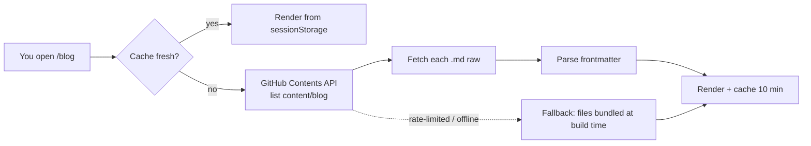

I wanted to post blogs and share prompts **without touching code** every time. No CMS, no database, no admin panel — just me pushing a markdown file to GitHub.

Here's how this site does exactly that.

## The idea

All content lives as plain files inside the repo:

```
content/
├── blog/          ← posts like this one (.md)
├── prompts/       ← my prompt library (.md)
└── data/          ← projects, skills, certifications (.json)
```

When you opened this page, your browser did the fetching — not a server:



If GitHub is unreachable or rate-limited, the site silently falls back to the copies that were bundled at build time. It never shows a broken page.

## Frontmatter is the whole "CMS"

Every post starts with a tiny metadata block:

```markdown
---
title: My New Post
date: 2026-07-13
summary: One-line preview shown in the list.
tags: [react, thoughts]
---

Post body in normal markdown…
```

The site parses this with a ~60-line parser — no YAML library, no Node polyfills. Title, date, tags, reading time, sorting: all derived from the file itself.

## Why not a real CMS?

| Option | Why I skipped it |
| --- | --- |
| Headless CMS (Contentful, Sanity) | Another account, another API key, another bill |
| Database + API | I'd be maintaining a backend for a personal site |
| Rebuild-on-push only | Works, but live fetch means edits appear even between deploys |
| **Markdown in the repo** | Versioned, diffable, editable from my phone on github.com |

The last row wins on every axis I care about. My content gets code review, history, and rollback for free — because it *is* code, minus the code.

## The publishing workflow now

1. Write a `.md` file (like this one)
2. `git push` — or edit directly on github.com from my phone
3. There is no step 3

Diagrams are just ` ```mermaid ` fences rendered client-side, code blocks get syntax highlighting, and images can sit next to the posts in the repo.

> If you're a developer with a portfolio: your content probably changes 100× more often than your layout. Split them, and you'll actually post things.
